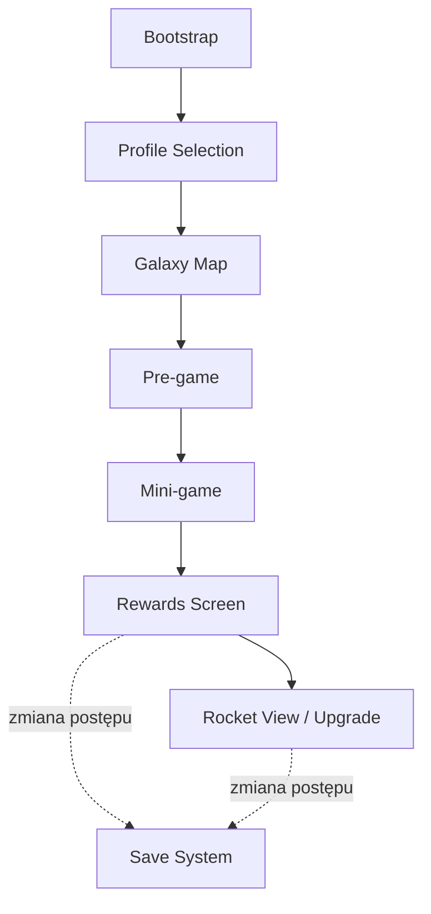
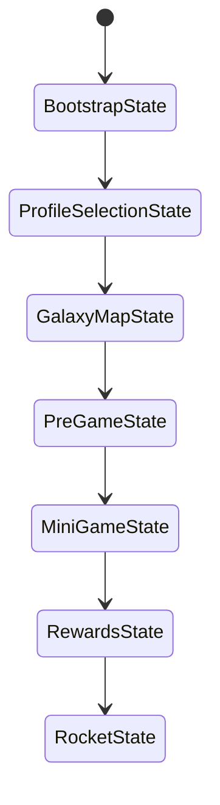
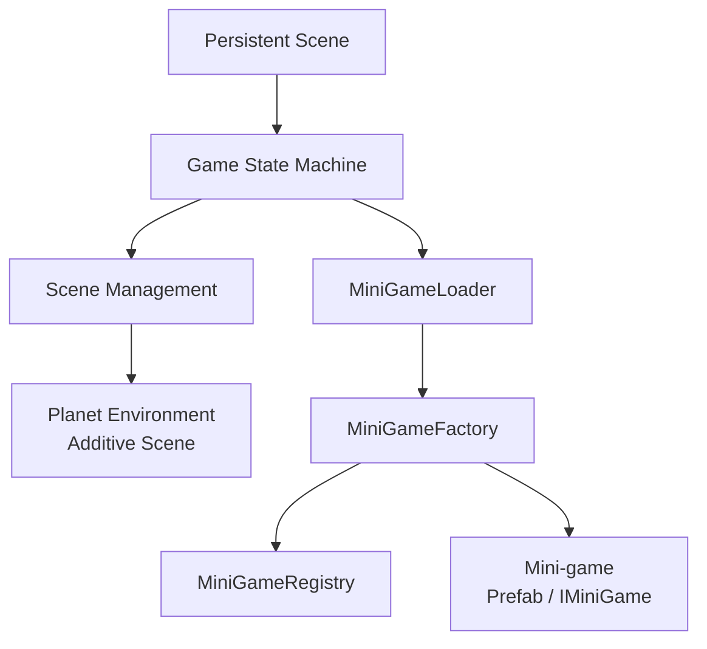
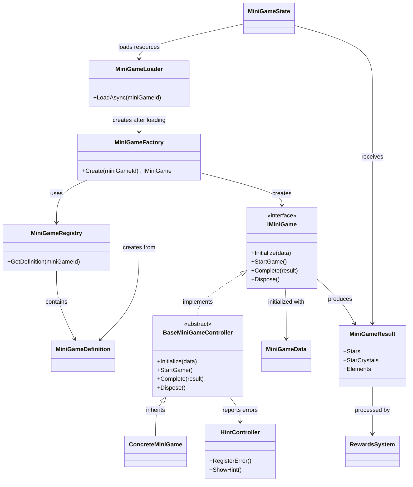
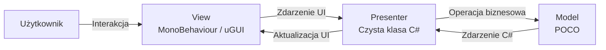
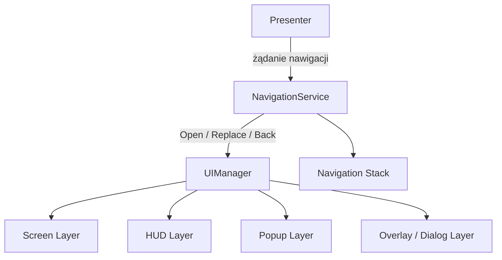
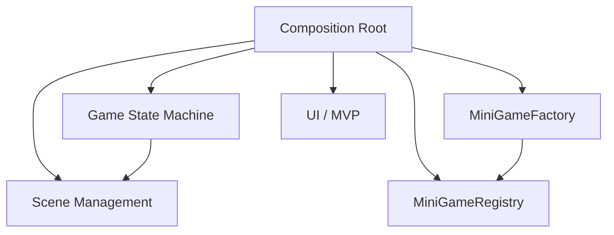
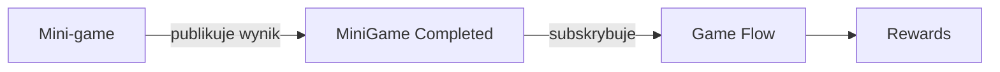

# AstroGame - Architektura systemu

## 1. Cel dokumentu
Dokument opisuje proponowaną architekturę systemową projektu AstroGame. 

Zakres dokumentu obejmuje:

- zarządzanie głównym przepływem gry,
- zarządzanie scenami i zawartością,
- framework mini-gier, 
- architekturę UI opartą na MVP, 
- zarządzanie zależnościami, 
- komunikację pomiędzy systemami, 
- wymagania wydajnościowe dla urządzeń mobilnych.

## 2. Przepływ gry
Główny przepływ aplikacji prowadzi gracza od wyboru profilu, przez wybór aktywności na Mapie Galaktyki, do rozegrania mini-gry i przetworzenia jej wyniku.

Podstawowy przepływ:
1. Wybór profilu gracza. 
2. Przejście do Mapy Galaktyki. 
3. Wybór planety / poziomu. 
4. Wyświetlenie etapu Pre-game (dialog NPC lub popup). 
5. Uruchomienie odpowiedniej mini-gry. 
6. Zakończenie mini-gry i przekazanie wyniku. 
7. Wyświetlenie ekranu nagród.
8. Przejście do podglądu / ulepszania rakiety.

### Diagram przepływu gry

### Zapis postępu

Zapis gry nie jest reprezentowany jako osobny stan Game State Machine, ponieważ nie stanowi niezależnego etapu flow aplikacji.

Zmiany trwałego postępu gracza, w tym wynik mini-gry oraz ulepszenia rakiety, są przekazywane do systemu zapisu w odpowiednich punktach flow. Mechanizm zapisu pozostaje niezależną usługą i nie zawiera logiki sterującej przejściami Game State Machine.

## 3. Game State Machine
Game State Machine odpowiada za zarządzanie wysokopoziomowym przepływem gry oraz przejściami między głównymi etapami aplikacji. 

Każdy stan reprezentuje jeden etap głównego flow i posiada jasno określoną odpowiedzialność. Game State Machine nie zarządza wewnętrzną logiką mini-gier ani logiką poszczególnych elementów UI.

| State | Responsibility |
|---|---|
| `BootstrapState` | Inicjalizacja systemów i danych wymaganych przed rozpoczęciem głównego flow gry. |
| `ProfileSelectionState` | Obsługa etapu wyboru profilu gracza. |
| `GalaxyMapState` | Obsługa etapu Mapy Galaktyki. |
| `PreGameState` | Obsługa etapu poprzedzającego mini-grę: Dialog NPC / Popup. |
| `MiniGameState` | Uruchomienie wybranej mini-gry oraz oczekiwanie na jej zakończenie. |
| `RewardsState` | Obsługa wyniku mini-gry oraz przejścia do ekranu nagród. |
| `RocketState` | Obsługa etapu podglądu i ulepszania rakiety. |

### Diagram maszyny stanów

### Cykl życia stanu
Każdy stan posiada ustandaryzowany cykl życia:

- **Enter** — wykonywany podczas wejścia w stan; przygotowuje dane i systemy wymagane przez dany etap.
- **Exit** — wykonywany przed opuszczeniem stanu; odpowiada za zakończenie pracy stanu i zwolnienie lub odpięcie zasobów należących do danego etapu.

Game State Machine odpowiada za aktywację nowego stanu oraz zakończenie poprzedniego stanu.

### Dane przekazywane pomiędzy stanami

Przejścia pomiędzy stanami mogą wymagać przekazania danych związanych z aktualnym flow.

Przykładowo `MiniGameState` przekazuje wynik zakończonej mini-gry do `RewardsState`. Wynik zawiera dane określone przez Mini-game Framework, m.in. liczbę zdobytych gwiazdek, Gwiezdne Kryształy oraz Pierwiastki.

Game State Machine odpowiada za przekazanie kontekstu pomiędzy stanami, ale nie przechowuje logiki biznesowej związanej z tymi danymi.

## 4. Zarządzanie scenami

Scene Management odpowiada za ładowanie i zwalnianie zawartości wymaganej przez aktualny stan Game State Machine.

Zarządzanie scenami jest oddzielone od logiki poszczególnych stanów. Stany określają, jaka zawartość jest wymagana, natomiast wykonanie operacji ładowania i zwalniania jest delegowane do dedykowanej warstwy Scene Management.

### Scena bazowa (persistent)

Projekt wykorzystuje bazową scenę persistent, ładowaną podczas uruchomienia aplikacji i pozostającą aktywną przez cały czas jej działania.

Scena persistent stanowi punkt wejścia dla systemów o cyklu życia obejmującym całą aplikację. Zawartość związana z konkretnym etapem gry jest ładowana i zwalniana niezależnie od niej.

### Środowisko 3D planety

Środowisko 3D planety jest ładowane jako osobna scena addytywna.

Pozwala to traktować środowisko jako niezależny kontener zawartości, który może posiadać własną hierarchię obiektów, oświetlenie oraz zasoby związane z daną planetą.

Scena planety może zostać załadowana i zwolniona bez usuwania systemów znajdujących się w scenie persistent.

### Ładowanie mini-gier

Mini-gry są traktowane jako niezależne moduły gameplayowe.

Przed utworzeniem mini-gry `MiniGameLoader` odpowiada za asynchroniczne przygotowanie wymaganych danych i zasobów. Po zakończeniu tego procesu `MiniGameFactory` tworzy odpowiednią implementację mini-gry na podstawie danych znajdujących się w `MiniGameRegistry`.

Mini-gra implementuje wspólny kontrakt `IMiniGame` niezależnie od swojej wewnętrznej implementacji.

Proponowanym sposobem reprezentacji mini-gier jest prefab ładowany i tworzony na potrzeby aktualnej rozgrywki.

Jeżeli konkretna mini-gra wymaga własnego rozbudowanego środowiska, oświetlenia lub innych zasobów scenowych, architektura powinna umożliwiać zastąpienie prefabu osobną sceną addytywną bez zmiany kontraktu `IMiniGame`.

### Strategia ładowania

Projekt wykorzystuje hybrydową strategię zarządzania zawartością:

| Zawartość | Strategia |
|---|---|
| Systemy działające na poziomie całej aplikacji | Scena persistent |
| Środowisko 3D planety | Scena ładowana addytywnie |
| Mini-gra | Prefab tworzony przez `MiniGameFactory` |
| Rozbudowana mini-gra | Scena ładowana addytywnie, jeśli będzie to wymagane |

### Diagram ładowania zawartości

## 5. Mini-game Framework

Mini-game Framework zapewnia wspólny sposób tworzenia, inicjalizacji, uruchamiania i kończenia wszystkich mini-gier w projekcie.

Każda mini-gra implementuje wspólny kontrakt `IMiniGame`, dzięki czemu Game State Machine może uruchamiać różne mini-gry bez znajomości ich wewnętrznej implementacji.

Za odnalezienie konfiguracji odpowiedniej mini-gry odpowiada `MiniGameRegistry`, natomiast `MiniGameFactory` odpowiada za utworzenie jej instancji.

### Registry i Factory
- `MiniGameRegistry` przechowuje rejestr dostępnych mini-gier i umożliwia odnalezienie definicji mini-gry na podstawie jej identyfikatora.
- `MiniGameFactory` korzysta z rejestru w celu utworzenia odpowiedniej mini-gry. Pozostałe systemy komunikują się z utworzoną mini-grą poprzez wspólny kontrakt `IMiniGame`, bez zależności od konkretnego typu mini-gry.

### Cykl życia mini-gry

Każda mini-gra implementuje wspólny kontrakt `IMiniGame`.

Cykl życia mini-gry jest ustandaryzowany dla wszystkich implementacji:

1. `Initialize(data)` — przekazanie danych wymaganych do przygotowania mini-gry.
2. `StartGame()` — rozpoczęcie właściwej rozgrywki.
3. `Complete(result)` — zakończenie mini-gry i przekazanie jej wyniku.
4. `Dispose()`- kończy techniczny cykl życia instancji mini-gry i zwalnia należące do niej zasoby.

`Complete(result)` oznacza zakończenie części gameplayowej i przekazanie wyniku rozgrywki. `Dispose()` jest osobnym etapem odpowiedzialnym za cleanup instancji mini-gry.

`Dispose()` odpowiada w szczególności za:

- odpięcie aktywnych subskrypcji,
- zwolnienie zasobów należących do mini-gry,
- zakończenie działania systemów utworzonych na potrzeby mini-gry,
- przygotowanie instancji do usunięcia lub zwrócenia do puli, jeżeli pooling jest wykorzystywany.

Game State Machine nie zna wewnętrznej implementacji konkretnej mini-gry i komunikuje się z nią wyłącznie poprzez wspólny kontrakt.

### Asynchroniczne przygotowanie mini-gry

Operacje wymagające ładowania danych lub zasobów są wykonywane asynchronicznie przed utworzeniem i inicjalizacją mini-gry.

Za przygotowanie zasobów odpowiada warstwa ładowania wywoływana przez `MiniGameState`. Po zakończeniu procesu ładowania `MiniGameFactory` tworzy odpowiednią implementację `IMiniGame`, która otrzymuje przygotowane dane poprzez `Initialize(data)`.

Asynchroniczne ładowanie nie jest częścią kontraktu `IMiniGame`. Dzięki temu mini-gra pozostaje niezależna od sposobu pozyskiwania zasobów, a jej cykl życia pozostaje jednolity:

`Initialize(data) → StartGame() → Complete(result) → Dispose()`

Takie rozwiązanie umożliwia wykonanie kosztownych operacji przed rozpoczęciem aktywnej rozgrywki i ogranicza ryzyko skoków czasu klatki podczas działania mini-gry na urządzeniach mobilnych.

Rozwiązanie powinno zostać zweryfikowane poprzez spike techniczny oraz profilowanie na docelowych urządzeniach mobilnych.

### Bazowy kontroler mini-gry

`BaseMiniGameController` stanowi bazową implementację kontraktu `IMiniGame` dla mini-gier.

Odpowiada za wspólne elementy cyklu życia mini-gry oraz integrację ze współdzielonymi elementami frameworka. Konkretne mini-gry dziedziczą po kontrolerze bazowym i implementują własną logikę rozgrywki.

`IMiniGame` pozostaje kontraktem wykorzystywanym przez pozostałe systemy, dzięki czemu Game State Machine i `MiniGameFactory` nie zależą od konkretnych implementacji mini-gier.

### Dane wejściowe

Podczas inicjalizacji mini-gra otrzymuje dane wymagane do przygotowania rozgrywki w postaci `MiniGameData`.

Pozwala to przekazywać konfigurację do mini-gry bez uzależniania Game State Machine od szczegółów jej implementacji.

### Wynik mini-gry

Po zakończeniu rozgrywki mini-gra tworzy `MiniGameResult`, który standaryzuje sposób przekazywania wyniku do pozostałych systemów.

Wynik zawiera:

- liczbę zdobytych gwiazdek (1–3),
- liczbę zdobytych Gwiezdnych Kryształów,
- zdobyte Pierwiastki.

`MiniGameResult` jest przekazywany po zakończeniu mini-gry i może zostać wykorzystany przez `RewardsState` do obsługi ekranu nagród.

### Helping Hand

System podpowiedzi jest niezależnym elementem Mini-game Framework.

Mini-gra informuje `HintController` o popełnieniu błędu przez gracza. `HintController` przechowuje licznik błędów i po osiągnięciu trzech błędów wywołuje podpowiedź dla aktualnej mini-gry.

Wyświetlenie podpowiedzi nie powoduje zakończenia ani ponownej inicjalizacji mini-gry — aktualna rozgrywka jest kontynuowana.

### Diagram klas Mini-game Framework

## 6. UI Architecture — Model-View-Presenter

Warstwa interfejsu użytkownika wykorzystuje wzorzec Model-View-Presenter (MVP) w celu oddzielenia komponentów wizualnych uGUI od danych i logiki biznesowej.

Każdy ekran UI składa się z trzech głównych elementów:

- **Model** — przechowuje stan danych i reguły biznesowe,
- **View** — odpowiada wyłącznie za prezentację oraz odbieranie interakcji użytkownika,
- **Presenter** — pośredniczy w komunikacji pomiędzy Modelem i Widokiem.

View nie posiada bezpośredniej referencji do Modelu. Model nie posiada zależności od Unity ani od warstwy UI.

### Model

Model jest czystą klasą C# (POCO) odpowiedzialną za przechowywanie stanu danych oraz reguł biznesowych.

Model:

- nie dziedziczy po `MonoBehaviour`,
- nie posiada zależności od `UnityEngine`,
- nie posiada wiedzy o warstwie UI,
- udostępnia operacje związane z zarządzanym stanem,
- informuje o zmianach danych za pomocą standardowych zdarzeń C# (`event Action<T>`).

Brak zależności od Unity umożliwia testowanie Modelu za pomocą testów jednostkowych bez konieczności uruchamiania sceny lub tworzenia obiektów Unity.

### View

View jest komponentem Unity dziedziczącym po bazowym `BaseView` (`MonoBehaviour`) i odpowiada wyłącznie za wizualną reprezentację ekranu.

View:

- przechowuje referencje do komponentów uGUI i TextMeshPro,
- odpowiada za aktualizację elementów wizualnych,
- obsługuje animacje wejścia i wyjścia,
- nasłuchuje interakcji użytkownika poprzez `CustomButtonBase`,
- przekazuje informacje o interakcjach do Presentera,
- nie posiada bezpośredniego dostępu do Modelu,
- nie wykonuje logiki biznesowej.

Bazowy cykl życia View obejmuje:

- `Initialize()` — przygotowanie widoku,
- `Show()` — wyświetlenie widoku,
- `Hide()` — ukrycie widoku.

### Presenter

Presenter jest czystą klasą C# i stanowi warstwę pośredniczącą pomiędzy View i Modelem.

Presenter:

- posiada referencję do odpowiedniego View i Modelu,
- reaguje na zdarzenia interakcji przekazywane przez View,
- wywołuje odpowiednie operacje na Modelu,
- subskrybuje zdarzenia zmian danych Modelu,
- przekazuje zaktualizowane dane do View,
- odpowiada za zarządzanie subskrypcjami zdarzeń.

Bazowy cykl życia Presentera obejmuje:

- `Activate()` — aktywacja Presentera i podpięcie wymaganych zdarzeń,
- `Deactivate()` — odpięcie zdarzeń podczas dezaktywacji ekranu,
- `Dispose()` — końcowe zwolnienie zasobów i subskrypcji Presentera.

### Diagram przepływu MVP

### Cykl życia i zarządzanie subskrypcjami

Presenter odpowiada za cykl życia subskrypcji pomiędzy View i Modelem.

Podczas `Activate()` Presenter podpina zdarzenia wymagane przez dany ekran.
Podczas `Deactivate()` zdarzenia są odpinane, dzięki czemu nieaktywny View nie otrzymuje aktualizacji i nie pozostawia aktywnych subskrypcji.

`Dispose()` kończy cykl życia Presentera i zapewnia zwolnienie wszystkich pozostałych subskrypcji.

Takie podejście ogranicza ryzyko wycieków pamięci oraz prób aktualizacji zniszczonych obiektów Unity (`MissingReferenceException`).

### Binding

Powiązanie View, Presentera i Modelu odbywa się podczas otwierania ekranu.

Mechanizm bindingu odpowiada za:

1. Utworzenie lub pobranie odpowiedniego Modelu.
2. Utworzenie i inicjalizację View.
3. Utworzenie Presentera oraz przekazanie mu referencji do View i Modelu.
4. Aktywację Presentera i wyświetlenie View.

Podczas zamykania ekranu Presenter zostaje dezaktywowany, a jego subskrypcje zdarzeń zostają odpięte.

Konkretny mechanizm odpowiedzialny za tworzenie i wiązanie elementów MVP zostanie określony wraz ze strategią zarządzania zależnościami.

### Zarządzanie ekranami i nawigacją

Zarządzanie ekranami UI jest rozdzielone pomiędzy `UIManager` oraz `NavigationService`.

`UIManager` odpowiada za techniczny cykl życia widoków, w szczególności za ich tworzenie, inicjalizację, binding elementów MVP, wyświetlanie, ukrywanie oraz zwalnianie.

`NavigationService` odpowiada za przepływ pomiędzy nawigowalnymi ekranami oraz przechowywanie historii nawigacji.

Dzięki temu logika nawigacji nie znajduje się w poszczególnych View ani Presenterach, a ekrany nie muszą posiadać bezpośrednich referencji do innych ekranów.

### Warstwy UI

Widoki są umieszczane w zdefiniowanych warstwach określających ich kolejność wyświetlania.

Podstawowy podział obejmuje:

- **Screen Layer** — główne ekrany aplikacji,
- **HUD Layer** — elementy HUD widoczne nad ekranem lub rozgrywką,
- **Popup Layer** — popupy wyświetlane nad aktualnym ekranem,
- **Overlay / Dialog Layer** — dialogi i elementy wymagające wyświetlenia ponad pozostałym UI.

Warstwa określa kolejność renderowania widoku, ale nie stanowi historii nawigacji.

### Navigation Stack

`NavigationService` przechowuje stos aktywnych ekranów nawigowalnych.

Otwarcie nowego ekranu dodaje go na szczyt stosu. Operacja `Back()` zamyka aktualny ekran i przywraca poprzedni ekran znajdujący się na stosie.

Elementy pomocnicze, takie jak HUD, tooltipy, notyfikacje oraz inne widoki nieuczestniczące w przepływie nawigacji, nie są dodawane do stosu.

Popup może zostać dodany do stosu, jeżeli stanowi część przepływu nawigacyjnego i powinien reagować na operację `Back`.

Podstawowe operacje `NavigationService`:

- `Open(viewId, data)` — otwarcie nowego ekranu i dodanie go do historii nawigacji,
- `Replace(viewId, data)` — zastąpienie aktualnego ekranu bez dodawania kolejnego poziomu historii,
- `Back()` — zamknięcie aktualnego ekranu i powrót do poprzedniego,
- `Clear()` — wyczyszczenie historii nawigacji.

### Game Flow a nawigacja UI

`NavigationService` odpowiada wyłącznie za nawigację wewnątrz warstwy UI i nie zastępuje Game State Machine.

Przejścia pomiędzy głównymi etapami gry, takimi jak Mapa Galaktyki, Pre-game, Mini-gra oraz Ekran nagród, pozostają odpowiedzialnością Game State Machine.

Navigation Stack jest wykorzystywany do zarządzania historią ekranów i popupów wewnątrz aktualnego kontekstu UI.

### Diagram zarządzania UI

### Zastosowanie MVP

Architektura MVP stanowi wspólny wzorzec dla kluczowych ekranów UI:

- Mapa Galaktyki,
- HUD,
- Popup poziomu,
- Dialog NPC,
- Ekran ulepszania rakiety.

Każdy z ekranów wykorzystuje ten sam podział odpowiedzialności pomiędzy Model, View i Presenter, zachowując separację logiki od komponentów uGUI.

## 7. Zarządzanie zależnościami

Zależności pomiędzy systemami powinny być jawne i przekazywane podczas ich tworzenia lub inicjalizacji.

Do tworzenia głównych systemów aplikacji oraz łączenia ich zależności wykorzystywany jest Composition Root. Stanowi on miejsce, w którym konfigurowane są zależności pomiędzy modułami aplikacji.

Pozwala to ograniczyć bezpośrednie zależności pomiędzy systemami oraz unikać wykorzystywania globalnego dostępu do obiektów jako podstawowego mechanizmu komunikacji.

### Composition Root

Composition Root odpowiada za utworzenie głównych systemów aplikacji oraz przekazanie im wymaganych zależności.

Systemy deklarują zależności, których potrzebują do działania, zamiast samodzielnie wyszukiwać lub tworzyć inne systemy.

Przykładowe zależności wynikające z zaprojektowanej architektury:

- `MiniGameFactory` korzysta z `MiniGameRegistry`,
- `MiniGameState` korzysta z `MiniGameLoader`,
- Game State Machine korzysta z warstwy Scene Management,
- `NavigationService` korzysta z `UIManager`,
- Presenter otrzymuje odpowiednie View oraz Model.

Szczegóły implementacyjne Composition Root oraz sposób przekazywania zależności zostaną ustalone na etapie implementacji.

### Uzasadnienie

Centralizacja tworzenia i konfiguracji zależności:

- zwiększa jawność zależności pomiędzy systemami,
- ogranicza coupling pomiędzy modułami,
- ułatwia zastępowanie implementacji,
- zwiększa możliwość testowania systemów w izolacji,
- oddziela tworzenie obiektów od ich właściwej logiki.

### Diagram zależności

### Zależności a komunikacja zdarzeniowa

Bezpośrednie zależności są wykorzystywane tam, gdzie jeden system świadomie korzysta z funkcjonalności drugiego systemu.

Komunikacja pomiędzy niezależnymi modułami, które nie powinny posiadać bezpośrednich referencji do siebie, realizowana jest poprzez komunikację zdarzeniową opisaną w kolejnej sekcji.

## 8. Komunikacja zdarzeniowa

Architektura przewiduje wykorzystanie komunikacji zdarzeniowej do wymiany informacji pomiędzy modułami, które nie powinny posiadać bezpośrednich zależności od swoich implementacji.

System publikujący zdarzenie informuje o wystąpieniu określonej zmiany lub akcji, bez konieczności znajomości systemów, które na to zdarzenie reagują.

Pozwala to ograniczyć coupling pomiędzy niezależnymi modułami i ułatwia ich rozwijanie oraz testowanie w izolacji.

### Zasady komunikacji

Komunikacja zdarzeniowa jest wykorzystywana przede wszystkim do informowania o zdarzeniach, które mogą być istotne dla wielu niezależnych systemów.

Bezpośrednie wywołania pozostają preferowanym sposobem komunikacji, gdy jeden system świadomie zleca wykonanie operacji innemu systemowi, który stanowi jego jawną zależność.

Przykładowo:

- utworzenie mini-gry przez `MiniGameFactory` jest bezpośrednim wywołaniem,
- pobranie definicji z `MiniGameRegistry` jest bezpośrednim wywołaniem,
- informacja o zakończeniu mini-gry może zostać przekazana jako zdarzenie,
- zmiana danych Modelu w MVP jest przekazywana do Presentera za pomocą zdarzenia C#.

### Zakres zdarzeń

Dla komunikacji wewnątrz pojedynczego modułu wykorzystywane są standardowe zdarzenia C# (`event Action` / `event Action<T>`).

Dotyczy to między innymi:

- komunikacji Model → Presenter w MVP,
- komunikacji związanej z cyklem życia mini-gry,
- lokalnych zdarzeń gameplayowych mini-gry.

Dla komunikacji pomiędzy niezależnymi modułami architektura przewiduje mechanizm komunikacji zdarzeniowej umożliwiający publikowanie i subskrybowanie zdarzeń bez tworzenia bezpośrednich zależności pomiędzy nadawcą i odbiorcą.

Konkretny mechanizm komunikacji między-modułowej zostanie ustalony na etapie implementacji.

### Przykład komunikacji zdarzeniowej

### Cykl życia subskrypcji

Każdy system subskrybujący zdarzenia odpowiada za odpięcie swoich subskrypcji po zakończeniu własnego cyklu życia.

Subskrypcje powinny być aktywne wyłącznie w okresie, w którym odbiorca może poprawnie obsłużyć dane zdarzenie.

Zapobiega to utrzymywaniu nieaktywnych obiektów w pamięci oraz próbom wywoływania logiki na obiektach, które zostały już dezaktywowane lub zniszczone.

## 9. Wydajność na urządzeniach mobilnych

Architektura projektu uwzględnia ograniczenia wydajnościowe urządzeń mobilnych. Krytycznym wymaganiem jest brak alokacji pamięci zarządzanej (GC Alloc) podczas wykonywania głównej pętli mini-gry.

Systemy wykorzystywane podczas aktywnej rozgrywki powinny być projektowane w taki sposób, aby po zakończeniu inicjalizacji nie generowały cyklicznych alokacji pamięci.

### Krytyczna ścieżka rozgrywki

Wymaganie braku alokacji dotyczy przede wszystkim operacji wykonywanych często podczas aktywnej mini-gry, w szczególności logiki wykonywanej co klatkę oraz obsługi często występujących zdarzeń gameplayowych.

Operacje inicjalizacyjne, przygotowanie danych oraz utworzenie wymaganych obiektów powinny być wykonywane przed rozpoczęciem właściwej pętli rozgrywki, jeśli pozwala na to charakter danego systemu.

### Zasady implementacyjne

W krytycznych fragmentach rozgrywki należy:

- unikać tworzenia nowych obiektów i kolekcji podczas każdej klatki,
- unikać LINQ w często wykonywanej logice,
- unikać tworzenia nowych delegatów i lambd podczas pętli rozgrywki,
- prealokować kolekcje, których rozmiar lub maksymalny rozmiar jest znany,
- cache'ować referencje do często używanych komponentów,
- ograniczać tworzenie nowych stringów podczas częstych aktualizacji,
- wykorzystywać pooling dla często tworzonych i usuwanych obiektów,
- unikać częstego `Instantiate` / `Destroy` podczas aktywnej rozgrywki,
- projektować często wywoływane zdarzenia w sposób niewymagający tworzenia nowych obiektów danych przy każdym wywołaniu.

### Object Pooling

Obiekty często tworzone i usuwane podczas mini-gry powinny korzystać z mechanizmu poolingu zamiast wielokrotnego tworzenia i niszczenia instancji.

Pule powinny być przygotowywane podczas inicjalizacji mini-gry, jeżeli możliwe jest określenie przewidywanej liczby wymaganych obiektów.

Pooling powinien być stosowany w miejscach, w których częste tworzenie i niszczenie obiektów występuje w krytycznej ścieżce rozgrywki, a nie jako obowiązkowy mechanizm dla wszystkich obiektów projektu.

### Komunikacja zdarzeniowa

Zdarzenia wykorzystywane w często wykonywanej logice mini-gry powinny być zaprojektowane w sposób niewymagający dodatkowych alokacji pamięci przy każdym wywołaniu.

Subskrypcje powinny być tworzone podczas inicjalizacji lub aktywacji systemu i usuwane po zakończeniu jego cyklu życia, zamiast być dynamicznie tworzone podczas każdej iteracji pętli rozgrywki.

### Aktualizacja UI

Elementy UI aktualizowane często podczas rozgrywki powinny być odświeżane wyłącznie w przypadku zmiany prezentowanych danych.

Aktualizacja wartości tekstowych i liczbowych powinna wykorzystywać mechanizmy ograniczające tworzenie tymczasowych stringów i innych zbędnych alokacji pamięci.

### Ładowanie i inicjalizacja mini-gier

Kosztowne operacje związane z przygotowaniem danych i zasobów mini-gry powinny być wykonywane przed rozpoczęciem aktywnej pętli rozgrywki.

Za asynchroniczne przygotowanie zasobów odpowiada `MiniGameLoader`. Po zakończeniu ładowania tworzona jest odpowiednia instancja mini-gry, która otrzymuje przygotowane dane podczas `Initialize(data)`.

Takie podejście ogranicza ryzyko blokowania głównego wątku oraz występowania skoków czasu klatki podczas rozpoczynania mini-gry na urządzeniach mobilnych.

Proces ładowania powinien zostać zweryfikowany poprzez profilowanie na urządzeniach docelowych, ze szczególnym uwzględnieniem czasu ładowania, wykorzystania pamięci oraz wpływu inicjalizacji na czas klatki.

### Weryfikacja wydajności

Założenia dotyczące braku alokacji powinny być weryfikowane za pomocą narzędzi profilujących Unity.

Profilowanie krytycznych fragmentów mini-gier powinno obejmować przede wszystkim:

- GC Alloc,
- częstotliwość wykonywania operacji,
- wykorzystanie CPU,
- tworzenie i niszczenie obiektów.

Ostateczna weryfikacja wydajności powinna być wykonywana również na docelowych urządzeniach mobilnych, ponieważ wyniki uzyskane w Unity Editor nie są w pełni reprezentatywne dla środowiska docelowego.

## 10. Architecture Decision Records

Poniższe rekordy opisują główne decyzje architektoniczne przyjęte w projekcie AstroGame.

Decyzje oznaczone jako **Proposed** stanowią aktualnie proponowany kierunek architektury i mogą zostać zmienione po weryfikacji podczas implementacji lub review technicznego.

### ADR-001 — Zarządzanie głównym przepływem gry

**Status:** Proposed

**Kontekst**

Projekt posiada zdefiniowany przepływ pomiędzy głównymi etapami gry: wyborem profilu, Mapą Galaktyki, etapem Pre-game, mini-grą, ekranem nagród oraz ekranem rakiety.

**Decyzja**

Główny przepływ aplikacji będzie zarządzany przez Game State Machine. Każdy wysokopoziomowy etap gry jest reprezentowany przez osobny stan posiadający ustandaryzowany cykl życia.

Game State Machine zarządza przejściami pomiędzy etapami, ale nie odpowiada za wewnętrzną logikę mini-gier ani poszczególnych elementów UI.

**Konsekwencje**

- główny przepływ aplikacji posiada jednoznacznie określone miejsce kontroli,
- odpowiedzialności poszczególnych etapów są od siebie oddzielone,
- struktura umożliwia rozszerzanie flow o kolejne stany bez przenoszenia ich logiki do istniejących stanów,
- stany wymagają poprawnego zarządzania własnym cyklem życia.

### ADR-002 — Strategia zarządzania scenami i zawartością

**Status:** Proposed

**Kontekst**

Projekt wymaga zarządzania zawartością o różnym cyklu życia: systemami działającymi przez cały czas działania aplikacji, środowiskami 3D planet oraz mini-grami.

**Decyzja**

Projekt wykorzystuje hybrydową strategię zarządzania zawartością:

- systemy działające na poziomie aplikacji znajdują się w scenie bazowej (persistent),
- środowiska 3D planet są ładowane jako sceny addytywne,
- mini-gry są domyślnie tworzone jako prefaby przez `MiniGameFactory`,
- architektura dopuszcza wykorzystanie sceny addytywnej dla mini-gry, jeśli wymaga tego jej złożoność.

**Konsekwencje**

- systemy aplikacyjne mogą pozostać aktywne podczas zmiany zawartości,
- środowiska planet mogą być niezależnie ładowane i zwalniane,
- mini-gry zachowują wspólny kontrakt niezależnie od sposobu reprezentacji,
- wymagane jest kontrolowanie cyklu życia ładowanej zawartości.

### ADR-003 — Standaryzacja mini-gier

**Status:** Proposed

**Kontekst**

Projekt zawiera wiele mini-gier o różnej wewnętrznej implementacji, które muszą współpracować ze wspólnym Game Flow, systemem podpowiedzi oraz systemem nagród.

**Decyzja**

Wszystkie mini-gry implementują wspólny kontrakt `IMiniGame` i wykorzystują ustandaryzowany cykl życia:

`Initialize(data) → StartGame() → Complete(result) → Dispose()`.

Za odnalezienie konfiguracji mini-gry odpowiada `MiniGameRegistry`, a za utworzenie odpowiedniej instancji `MiniGameFactory`.
Asynchroniczne przygotowanie danych i zasobów odbywa się przed inicjalizacją mini-gry i pozostaje poza kontraktem `IMiniGame`. Za ten etap odpowiada `MiniGameLoader`.

Wyniki mini-gier są przekazywane w ustandaryzowanej postaci `MiniGameResult`.

**Konsekwencje**

- Game Flow nie musi znać konkretnej implementacji mini-gry,
- nowe mini-gry korzystają z tego samego cyklu życia i sposobu przekazywania wyników,
- wspólne systemy mogą współpracować z mini-grami poprzez jeden kontrakt,
- każda mini-gra musi dostosować swoją implementację do kontraktu frameworka.

### ADR-004 — Architektura UI oparta na MVP

**Status:** Accepted

**Kontekst**

Logika ekranów UI musi być oddzielona od komponentów wizualnych uGUI, aby umożliwić testowanie logiki oraz ograniczyć zależności pomiędzy interfejsem i danymi aplikacji.

**Decyzja**

Warstwa UI wykorzystuje wzorzec Model-View-Presenter.

View odpowiada za prezentację i interakcje użytkownika, Model za dane i logikę biznesową, a Presenter pośredniczy pomiędzy nimi.

View nie posiada bezpośredniej zależności od Modelu, a Model pozostaje niezależny od Unity i warstwy UI.

**Konsekwencje**

- logika może być testowana niezależnie od komponentów uGUI,
- View pozostaje ograniczony do odpowiedzialności wizualnych,
- komunikacja pomiędzy UI i logiką posiada ustandaryzowany kierunek,
- wymagane jest poprawne zarządzanie cyklem życia Presenterów i subskrypcji.

### ADR-005 — Zarządzanie zależnościami

**Status:** Proposed

**Kontekst**

Główne moduły aplikacji wymagają dostępu do innych systemów, jednocześnie architektura powinna ograniczać niejawne i globalne zależności.

**Decyzja**

Tworzenie i konfiguracja głównych zależności są centralizowane w Composition Root.

Systemy otrzymują wymagane zależności podczas tworzenia lub inicjalizacji, zamiast samodzielnie wyszukiwać ich implementacje.

Konkretny mechanizm Dependency Injection zostanie określony na etapie implementacji.

**Konsekwencje**

- zależności pomiędzy systemami są jawne,
- systemy mogą być łatwiej testowane w izolacji,
- ograniczony zostaje coupling wynikający z globalnego dostępu do obiektów,
- konfiguracja zależności wymaga utrzymywania centralnego punktu kompozycji.

### ADR-006 — Komunikacja zdarzeniowa

**Status:** Proposed

**Kontekst**

Niezależne moduły aplikacji wymagają możliwości reagowania na zdarzenia bez tworzenia bezpośrednich zależności pomiędzy nadawcą i wszystkimi potencjalnymi odbiorcami.

**Decyzja**

Architektura przewiduje wykorzystanie komunikacji zdarzeniowej pomiędzy modułami, które nie powinny posiadać bezpośrednich zależności.

Standardowe zdarzenia C# mogą być wykorzystywane do komunikacji lokalnej. Konkretny mechanizm komunikacji zdarzeniowej pomiędzy niezależnymi modułami zostanie określony na etapie implementacji.

Bezpośrednie wywołania pozostają wykorzystywane w sytuacjach, w których jeden system jawnie zleca operację swojej zależności.

**Konsekwencje**

- nadawca zdarzenia nie musi znać jego odbiorców,
- możliwe jest niezależne rozszerzanie reakcji na istniejące zdarzenia,
- wymagane jest jawne zarządzanie cyklem życia subskrypcji,
- nadmierne wykorzystanie zdarzeń może utrudnić śledzenie przepływu sterowania.

### ADR-007 — Brak alokacji GC w pętli mini-gry

**Status:** Accepted

**Kontekst**

AstroGame jest projektem mobilnym, a wymagania projektu zakładają brak alokacji pamięci zarządzanej podczas aktywnej pętli mini-gry.

**Decyzja**

Systemy uczestniczące w krytycznej ścieżce rozgrywki są projektowane w sposób niewymagający cyklicznych alokacji pamięci po zakończeniu inicjalizacji mini-gry.

Dane, kolekcje i obiekty wymagane podczas rozgrywki powinny być, tam gdzie jest to uzasadnione, przygotowywane przed rozpoczęciem aktywnej pętli gry lub ponownie wykorzystywane.

**Konsekwencje**

- implementacje mini-gier muszą uwzględniać koszt alokacji już na etapie projektowania,
- często tworzone obiekty mogą wymagać poolingu lub prealokacji,
- często wykonywane operacje muszą unikać niepotrzebnych alokacji,
- wymaganie musi być weryfikowane za pomocą profilowania.

### ADR-008 — Zarządzanie ekranami i nawigacją UI

**Status:** Proposed

**Kontekst**

Warstwa MVP określa odpowiedzialności pojedynczego ekranu, ale nie rozwiązuje zarządzania wieloma aktywnymi widokami, ich kolejnością wyświetlania oraz historią nawigacji.

**Decyzja**

Zarządzanie UI zostaje rozdzielone pomiędzy `UIManager` i `NavigationService`.

`UIManager` odpowiada za techniczny cykl życia widoków oraz ich rozmieszczenie w warstwach UI.

`NavigationService` odpowiada za historię nawigacji i wykorzystuje Navigation Stack do obsługi operacji `Open`, `Replace`, `Back` i `Clear`.

Game State Machine pozostaje odpowiedzialny za wysokopoziomowy przepływ gry. Navigation Stack nie zastępuje stanów Game State Machine.

**Konsekwencje**

- ekrany nie wymagają bezpośrednich referencji do innych ekranów,
- kolejność wyświetlania UI jest zarządzana centralnie,
- zachowanie operacji `Back` jest ustandaryzowane,
- elementy nieuczestniczące w nawigacji nie są dodawane do historii ekranów,
- wymagane jest jednoznaczne określenie, które widoki uczestniczą w Navigation Stack.